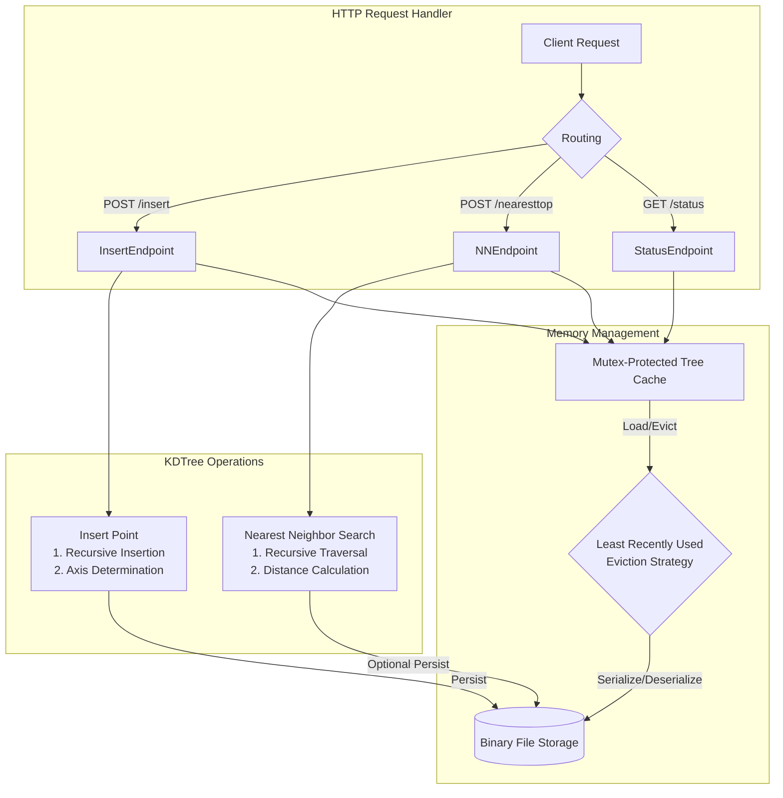

# Vector-Store

A lightweight, disk-persistent vector storage and search service using KD-Trees. Built with Rust and Actix-web, providing efficient nearest neighbor search capabilities with automatic memory management. 
<br/>
# Use case 
- [RAG-Framework](https://github.com/Abhigyan126/RAG-Framework) 
- [LLM + MEM](https://github.com/Abhigyan126/LLM-MEM)

## Flowchart


## Features

- 🚀 Fast nearest neighbor search using KD-Trees
- 💾 Disk persistence for large datasets
- 🔄 LRU-based memory management
- 🌲 Multiple independent trees support
- 🔌 RESTful API interface
- ⚙️ Configurable memory limits

## Installation

```bash
# Clone the repository
git clone https://github.com/yourusername/Vector-Store.git

# Navigate to project directory
cd Vector-Store

# Build the project
cargo build --release

# Run the server
cargo run --release
```

## Configuration

Create a `.env` file in the project root:

```env
HOST=127.0.0.1
PORT=8080
MAX_MEMORY_MB=1024
BIN_DIRECTORY=bin
```

## API Reference

### Insert Vector
Adds a vector to a specified tree.

```bash
POST /insert?tree_name={tree_name}
Content-Type: application/json

# Request Body: Array of numbers representing the vector
[0.5, 0.3, 0.8]

# Response: 200 OK
"Point inserted into KD-Tree and saved to disk"
```

### Find Nearest Neighbors
Finds the n-nearest neighbors for a given vector.

```bash
POST /nearesttop?tree_name={tree_name}&n={number_of_neighbors}
Content-Type: application/json

# Request Body: Array of numbers representing the query vector
[0.5, 0.3, 0.8]

# Response: 200 OK
[
  [0.51, 0.31, 0.79],
  [0.49, 0.32, 0.81]
]
```

### Get Status
Retrieves the current status of all trees.

```bash
GET /status

# Response: 200 OK
{
  "active_trees": 1,
  "trees": [
    {
      "tree_name": "example_tree",
      "num_records": 1000,
      "in_memory": true,
      "last_accessed": 60
    }
  ]
}
```

## Error Codes

- `200`: Success
- `400`: Invalid request
- `404`: Tree/points not found
- `500`: Internal server error

## Build Requirements

- Rust 1.54+
- Cargo
- libssl-dev (for HTTPS support)

## Dependencies

```toml
[dependencies]
actix-web = "4.0"
serde = { version = "1.0", features = ["derive"] }
serde_json = "1.0"
dotenv = "0.15"
```


